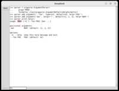

DeepBook is a simple encrypted notebook.

It uses GPG to encrypt/decrypt data.

Use the first ultimate encryption key found from the default keyring
to encrpt and decrypt data.

You can not choice files.  It always read and write deepbook.gpg.

## KEY

 - < Ctrl-s >   search
 - < Esc >      stop search

